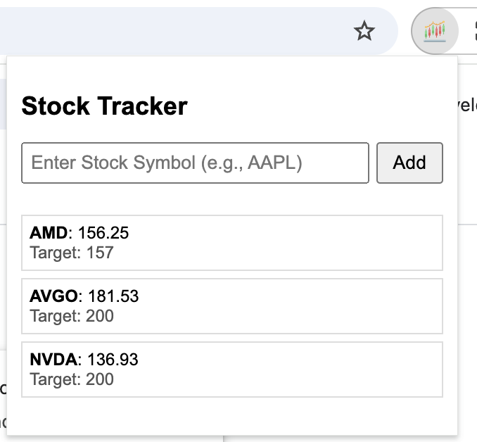

# Stock Tracker Chrome Extension


## Table of Contents

- [Overview](#overview)
- [Features](#features)
- [Demo](#demo)
- [Installation](#installation)
- [Usage](#usage)
- [Technologies Used](#technologies-used)
- [API Information](#api-information)
- [Contributing](#contributing)
- [License](#license)
- [Additional Tips](#additional-tips)

## Overview

**Stock Tracker** is a Chrome Extension designed to help users monitor up to 10 stock symbols of their choice. With a user-friendly interface, this extension provides real-time stock prices, allows setting target prices for notifications, and offers seamless management of your stock list directly from the browser toolbar.

## Features

- **Add/Delete Stocks**: Easily add up to 10 stock symbols to your watchlist and remove them as needed.
- **Real-Time Prices**: View the current price of each tracked stock with a simple click on the extension icon.
- **Set Target Prices**: Specify target prices for each stock. The extension checks prices every minute and notifies you when targets are met.
- **User-Friendly Interface**: Intuitive popup interface with modals for setting target prices and managing your stock list.
- **Desktop Notifications**: Receive instant notifications when a stock reaches your specified target price.

## Demo



*Screenshot of the Stock Tracker popup interface showing a list of tracked stocks with their current prices.*

## Installation

1. **Clone the Repository**

   ```bash
   git clone https://github.com/yourusername/stock-tracker-extension.git
   
2. **Navigate to the Directory**
   ```bash
   cd stock-tracker-extension

3. **Obtain a Finnhub API Key**
   Sign up for a free account at Finnhub.
   Retrieve your API key from the dashboard.
